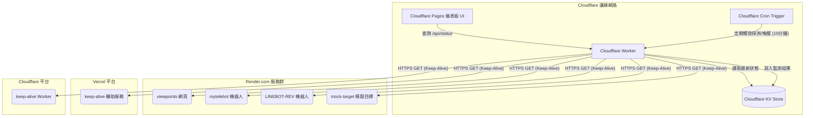

# 技術規格書

## 1. 系統概述

基於 Cloudflare Edge Network，建構一套「服務狀態監控」與「Keep-Alive 心跳保持」雙效合一的多雲端儀表板系統。目標是對散落在 Render.com、Vercel、Cloudflare 等平台的 Web 服務進行定時探測，並防止 Render.com 免費方案因閒置 15 分鐘而進入休眠。

## 2. 系統架構

## 3. 元件規格

### 3.1 Cloudflare Worker (`src/index.js`)

| 屬性 | 規格 |
|------|------|
| Runtime | Cloudflare Workers (ES Modules) |
| Entry Point | `export default { fetch, scheduled }` |
| 併發模型 | `Promise.all` + `AbortController` 10s 超時 |
| KV Binding | `PORTAL_KV` |

**API 路由：**

| 方法 | 路徑 | 功能 |
|------|------|------|
| `GET` | `/api/status` | 讀取 KV 快取的服務狀態 |
| `GET` | `/api/trigger` | 手動觸發即時探測並更新 KV |

**Cron Trigger：**
- 表達式：`*/10 * * * *`（每 10 分鐘）
- 行為：全量探測所有服務，結果寫入 KV

**KV Key 格式：**
- Key: `cloud_services_status`
- Value: `{ lastUpdated: ISO8601, devices: [...] }`

### 3.2 服務設定檔 (`src/config.js`)

匯出名為 `SERVICES` 的陣列，每個元素包含：

| 欄位 | 類型 | 說明 |
|------|------|------|
| `id` | `string` | 唯一識別碼 |
| `name` | `string` | 顯示名稱 |
| `platform` | `string` | 平台分類 (Render.com / Vercel / Cloudflare) |
| `url` | `string` | 健康檢查或首頁網址 |
| `type` | `string` | 服務類型 (web / bot / api / keep-alive) |

### 3.3 儀表板前端 (`dashboard/`)

| 屬性 | 規格 |
|------|------|
| 託管方式 | Cloudflare Pages 靜態網站 |
| 設計風格 | 暗色 Glassmorphism（玻璃擬態） |
| 字體 | Outfit (Google Fonts) |
| 資料來源 | Worker API (`/api/status`) |

**版面分區：**
- Render.com 服務群
- Vercel 平台
- Cloudflare 平台

**卡片狀態：**
- `online`（綠）：HTTP 2xx
- `degraded`（黃）：HTTP 非 2xx
- `offline`（紅）：連線逾時或網路錯誤

### 3.4 Wrangler 設定 (`wrangler.toml`)

| 欄位 | 值 |
|------|-----|
| `name` | `cloud-services-monitor` |
| `main` | `src/index.js` |
| `compatibility_date` | `2026-05-22` |
| KV Binding | `PORTAL_KV` |
| Cron | `*/10 * * * *` |

## 4. 資料流

1. **Cron 觸發** → Worker 併發 GET 請求至所有服務 URL
2. **探測結果** → 組合為 `{ lastUpdated, devices: [...] }` JSON
3. **寫入 KV** → Key: `cloud_services_status`
4. **前端請求** → `GET /api/status` 讀取 KV 快取
5. **手動觸發** → `GET /api/trigger` 重新執行全量探測

## 5. 容錯設計

- 單一服務逾時不影響整體：`AbortController` 10 秒硬性超時
- 前端讀取 KV 快取：不因個別服務 Cold Start 而卡住
- 前端 CORS 全面開放（Worker 端設定 corsHeaders）

## 6. 部署要求

- Node.js >= 18
- Wrangler CLI (`npm install -g wrangler`)
- Cloudflare 帳號（含 Workers + KV + Pages 額度）
- Render.com / Vercel 等目標服務的公開 URL
