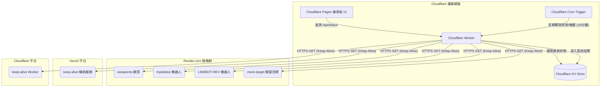

# Cloudflare 邊緣部署：多雲端服務狀態與 Keep-Alive 整合儀表板

本文件針對您分散在多個雲端平台（Render.com、Vercel、Cloudflare）的服務（例如 `viewpoints`, `mytelebot`, `LINEBOT-REV`, `mock-target` 等），提出一套**雲端原生主動探測與心跳保持 (Keep-Alive) 雙效合一**的邊緣儀表板設計。

---

## 1. 架構設計與運作流程

因為您要監控的服務都是公網服務，因此不需要在本地端部署任何探測腳本。我們可以直接利用 **Cloudflare Workers** 的邊緣計算能力進行定時探測。

### 雙效合一機制 (Probing + Keep-Alive)
Render.com 的免費版服務在閒置 15 分鐘後會自動休眠（Spin down），導致下次存取（如 Bot 接收訊息）時需要 30 秒以上的 Cold Start 啟動時間。
本方案將 **「服務狀態監控」** 與 **「Keep-Alive 心跳保持」** 整合：
- **定時喚醒與探測**：配置 Cloudflare Workers 的 **Cron Trigger**（例如每 10 分鐘一次），自動發送 HTTPS 請求到您的各個 Render 與 Vercel 服務。這項 fetch 動作除了能確認服務是否存活，還能**強迫 Render 與 Vercel 服務保持活躍而不進入休眠**。
- **邊緣緩存**：每次探測的結果（延遲、HTTP 狀態碼、在線狀態、最後探測時間）會直接寫入 **Cloudflare KV**。
- **快取渲染**：前端網頁 (Cloudflare Pages) 僅需讀取 KV 的快取資料，確保網頁開啟速度在毫秒級別，且不會因為某個被監控服務正在 Cold Start 而導致儀表板卡住。

### 系統架構圖


---

## 2. Cloudflare Worker 程式碼 (探測、喚醒與 API 整合)

此 Worker 腳本同時支援 `fetch`（供前端查詢與手動觸發）與 `scheduled`（由 Cron 定時執行探測與喚醒）。

```javascript
// 欲監控與保持活躍的雲端服務清單
const SERVICES = [
  {
    id: "viewpoints",
    name: "Viewpoints 筆記服務",
    platform: "Render.com",
    url: "https://viewpoints-4dzi.onrender.com/index.html",
    type: "web"
  },
  {
    id: "mytelebot",
    name: "My Telegram Bot (mimas9107stu)",
    platform: "Render.com",
    url: "https://mytelebot-your-id.onrender.com/health", // 需替換為您實際的健康檢查或 Bot Webhook 網址
    type: "bot"
  },
  {
    id: "linebot-rev",
    name: "LINEBOT-REV 機器人",
    platform: "Render.com",
    url: "https://linebot-rev-your-id.onrender.com/", // 需替換為您實際的網址
    type: "bot"
  },
  {
    id: "mock-target",
    name: "Mock Target 模擬端點",
    platform: "Render.com",
    url: "https://mock-target-your-id.onrender.com/",
    type: "api"
  },
  {
    id: "vercel-keepalive",
    name: "Vercel Keep-Alive 服務",
    platform: "Vercel",
    url: "https://your-vercel-keepalive-app.vercel.app/api/ping",
    type: "keep-alive"
  },
  {
    id: "cloudflare-keepalive",
    name: "Cloudflare Keep-Alive Worker",
    platform: "Cloudflare",
    url: "https://your-cf-keepalive.workers.dev/",
    type: "keep-alive"
  }
];

// 執行單一服務探測與喚醒
async function probeService(service) {
  const startTime = Date.now();
  try {
    // 設定 10 秒超時，防止個別服務卡住影響整體探測
    const controller = new AbortController();
    const timeoutId = setTimeout(() => controller.abort(), 10000);

    const response = await fetch(service.url, {
      method: "GET",
      headers: {
        "User-Agent": "Cloudflare-Service-Monitor/1.0",
        "Cache-Control": "no-cache"
      },
      signal: controller.signal
    });
    
    clearTimeout(timeoutId);
    const latency = Date.now() - startTime;

    return {
      id: service.id,
      name: service.name,
      platform: service.platform,
      url: service.url,
      type: service.type,
      status: response.ok ? "online" : "degraded",
      statusCode: response.status,
      latency: latency,
      lastChecked: new Date().toISOString()
    };
  } catch (error) {
    return {
      id: service.id,
      name: service.name,
      platform: service.platform,
      url: service.url,
      type: service.type,
      status: "offline",
      statusCode: 0,
      latency: Date.now() - startTime,
      reason: error.name === "AbortError" ? "Timeout (10s)" : error.message,
      lastChecked: new Date().toISOString()
    };
  }
}

export default {
  // 處理前端 HTTP 請求
  async fetch(request, env, ctx) {
    const url = new URL(request.url);

    const corsHeaders = {
      "Access-Control-Allow-Origin": "*",
      "Access-Control-Allow-Methods": "GET, OPTIONS",
      "Access-Control-Allow-Headers": "Content-Type",
    };

    if (request.method === "OPTIONS") {
      return new Response(null, { headers: corsHeaders });
    }

    // 路由 1：GET /api/status - 獲取當前所有雲端服務狀態
    if (url.pathname === "/api/status" && request.method === "GET") {
      const cachedData = await env.PORTAL_KV.get("cloud_services_status");
      return new Response(cachedData || JSON.stringify({ devices: [], lastUpdated: null }), {
        status: 200,
        headers: { "Content-Type": "application/json; charset=utf-8", ...corsHeaders }
      });
    }

    // 路由 2：GET /api/trigger - 手動觸發即時探測與喚醒
    if (url.pathname === "/api/trigger" && request.method === "GET") {
      const results = await Promise.all(SERVICES.map(probeService));
      const payload = {
        lastUpdated: new Date().toISOString(),
        devices: results
      };
      
      await env.PORTAL_KV.put("cloud_services_status", JSON.stringify(payload));
      
      return new Response(JSON.stringify(payload), {
        status: 200,
        headers: { "Content-Type": "application/json; charset=utf-8", ...corsHeaders }
      });
    }

    return new Response(JSON.stringify({ error: "Not Found" }), {
      status: 404,
      headers: corsHeaders
    });
  },

  // 定期 Cron 觸發探測與 Keep-Alive 喚醒
  async scheduled(event, env, ctx) {
    ctx.waitUntil(
      (async () => {
        const results = await Promise.all(SERVICES.map(probeService));
        const payload = {
          lastUpdated: new Date().toISOString(),
          devices: results
        };
        await env.PORTAL_KV.put("cloud_services_status", JSON.stringify(payload));
        console.log("定時探測與 Keep-Alive 喚醒完成。");
      })()
    );
  }
};
```

---

## 3. wrangler.toml 設定說明

要將此 Worker 部署至 Cloudflare，請準備以下 `wrangler.toml` 檔案，配置 KV 綁定與 Cron 觸發器：

```toml
name = "cloud-services-monitor"
main = "src/index.js"
compatibility_date = "2026-05-22"

# 綁定 KV 命名空間，用以存儲探測結果
kv_namespaces = [
  { binding = "PORTAL_KV", id = "<your-kv-namespace-id>" }
]

# 配置 Cron Triggers 定時器 (每 10 分鐘探測一次以保持 Render 活躍)
[triggers]
crons = ["*/10 * * * *"]
```

---

## 4. 儀表板前端 UI (Cloudflare Pages / 靜態網頁)

儀表板採用現代感 **Glassmorphism (玻璃擬態)** 暗色風格，並能依平台分類（Render, Vercel, Cloudflare）清晰顯示。

### index.html
```html
<!DOCTYPE html>
<html lang="zh-TW">
<head>
  <meta charset="UTF-8">
  <meta name="viewport" content="width=device-width, initial-scale=1.0">
  <title>雲端服務狀態與 Keep-Alive 監控儀表板</title>
  <link href="https://fonts.googleapis.com/css2?family=Outfit:wght@300;400;600&display=swap" rel="stylesheet">
  <style>
    :root {
      --bg-gradient: linear-gradient(135deg, #090d16 0%, #111827 100%);
      --glass-bg: rgba(255, 255, 255, 0.02);
      --glass-border: rgba(255, 255, 255, 0.07);
      --text-main: #f3f4f6;
      --text-muted: #9ca3af;
      --accent-online: #10b981;
      --accent-degraded: #f59e0b;
      --accent-offline: #ef4444;
      --glow-online: rgba(16, 185, 129, 0.15);
      --glow-degraded: rgba(245, 158, 11, 0.15);
      --glow-offline: rgba(239, 68, 68, 0.15);
    }

    * {
      box-sizing: border-box;
      margin: 0;
      padding: 0;
    }

    body {
      font-family: 'Outfit', sans-serif;
      background: var(--bg-gradient);
      color: var(--text-main);
      min-height: 100vh;
      display: flex;
      flex-direction: column;
      align-items: center;
      padding: 3rem 1.5rem;
    }

    .container {
      width: 100%;
      max-width: 900px;
    }

    header {
      text-align: center;
      margin-bottom: 4rem;
      position: relative;
    }

    h1 {
      font-size: 2.4rem;
      font-weight: 600;
      letter-spacing: -0.8px;
      margin-bottom: 0.75rem;
      background: linear-gradient(90deg, #38bdf8, #818cf8, #c084fc);
      -webkit-background-clip: text;
      -webkit-text-fill-color: transparent;
    }

    .status-meta {
      font-size: 0.9rem;
      color: var(--text-muted);
      display: flex;
      justify-content: center;
      align-items: center;
      gap: 1rem;
    }

    .btn-refresh {
      background: rgba(255, 255, 255, 0.05);
      border: 1px solid var(--glass-border);
      color: var(--text-main);
      padding: 0.4rem 0.8rem;
      border-radius: 8px;
      cursor: pointer;
      font-family: inherit;
      font-size: 0.8rem;
      transition: background 0.2s;
    }

    .btn-refresh:hover {
      background: rgba(255, 255, 255, 0.12);
    }

    .section-title {
      font-size: 1.1rem;
      font-weight: 600;
      color: var(--text-muted);
      margin: 2.5rem 0 1rem 0;
      letter-spacing: 0.5px;
      text-transform: uppercase;
      border-bottom: 1px solid var(--glass-border);
      padding-bottom: 0.5rem;
    }

    .dashboard-grid {
      display: grid;
      grid-template-columns: repeat(auto-fit, minmax(280px, 1fr));
      gap: 1.5rem;
    }

    .card {
      background: var(--glass-bg);
      border: 1px solid var(--glass-border);
      border-radius: 16px;
      padding: 1.5rem;
      backdrop-filter: blur(16px);
      -webkit-backdrop-filter: blur(16px);
      transition: transform 0.3s cubic-bezier(0.25, 0.8, 0.25, 1), box-shadow 0.3s, border-color 0.3s;
      cursor: pointer;
      text-decoration: none;
      color: inherit;
      display: flex;
      flex-direction: column;
      justify-content: space-between;
      position: relative;
    }

    .card:hover {
      transform: translateY(-4px);
      border-color: rgba(255, 255, 255, 0.18);
      box-shadow: 0 12px 30px -10px rgba(0, 0, 0, 0.5);
    }

    .card-header {
      display: flex;
      justify-content: space-between;
      align-items: flex-start;
      margin-bottom: 1.5rem;
    }

    .info-group {
      display: flex;
      flex-direction: column;
    }

    .device-name {
      font-weight: 600;
      font-size: 1.15rem;
      letter-spacing: -0.3px;
      margin-bottom: 0.2rem;
    }

    .device-platform {
      font-size: 0.75rem;
      color: var(--text-muted);
      background: rgba(255, 255, 255, 0.05);
      padding: 0.1rem 0.4rem;
      border-radius: 4px;
      width: fit-content;
    }

    .status-badge {
      font-size: 0.75rem;
      font-weight: 600;
      text-transform: uppercase;
      padding: 0.25rem 0.6rem;
      border-radius: 9999px;
      letter-spacing: 0.5px;
    }

    .online .status-badge {
      background: rgba(16, 185, 129, 0.08);
      color: var(--accent-online);
      box-shadow: 0 0 12px var(--glow-online);
    }

    .degraded .status-badge {
      background: rgba(245, 158, 11, 0.08);
      color: var(--accent-degraded);
      box-shadow: 0 0 12px var(--glow-degraded);
    }

    .offline .status-badge {
      background: rgba(239, 68, 68, 0.08);
      color: var(--accent-offline);
      box-shadow: 0 0 12px var(--glow-offline);
    }

    .card-footer {
      display: flex;
      justify-content: space-between;
      align-items: center;
      font-size: 0.8rem;
      color: var(--text-muted);
      border-top: 1px solid rgba(255, 255, 255, 0.03);
      padding-top: 0.75rem;
    }

    .latency {
      font-family: monospace;
    }

    .loading-text {
      text-align: center;
      color: var(--text-muted);
      margin: 5rem 0;
      font-size: 1.1rem;
    }
  </style>
</head>
<body>
  <div class="container">
    <header>
      <h1>雲端服務整合儀表板</h1>
      <div class="status-meta">
        <span id="status-meta">正在獲取狀態...</span>
        <button class="btn-refresh" onclick="triggerProbe()" id="btn-refresh">立即檢測</button>
      </div>
    </header>

    <div id="loader" class="loading-text">連線至 Cloudflare Edge...</div>
    
    <div id="dashboard-sections">
      <div class="section-title">Render.com 服務群</div>
      <div class="dashboard-grid" id="grid-render"></div>

      <div class="section-title">Vercel 平台</div>
      <div class="dashboard-grid" id="grid-vercel"></div>

      <div class="section-title">Cloudflare 平台</div>
      <div class="dashboard-grid" id="grid-cloudflare"></div>
    </div>
  </div>

  <script>
    const WORKER_URL = "https://your-worker-name.your-subdomain.workers.dev";

    async function fetchStatus() {
      try {
        const response = await fetch(`${WORKER_URL}/api/status`);
        if (!response.ok) throw new Error("API 異常");
        const payload = await response.json();
        renderDashboard(payload);
      } catch (err) {
        document.getElementById('status-meta').innerText = "獲取狀態失敗";
        document.getElementById('loader').innerText = "無法載入狀態快取，請確認 Worker 與 KV 是否正常配置。";
      }
    }

    async function triggerProbe() {
      const btn = document.getElementById('btn-refresh');
      const meta = document.getElementById('status-meta');
      btn.disabled = true;
      btn.innerText = "探測中...";
      meta.innerText = "正在向各雲端平台發送探測與喚醒請求，請稍候...";

      try {
        const response = await fetch(`${WORKER_URL}/api/trigger`);
        if (!response.ok) throw new Error("觸發失敗");
        const payload = await response.json();
        renderDashboard(payload);
      } catch (err) {
        meta.innerText = "手動探測失敗";
      } finally {
        btn.disabled = false;
        btn.innerText = "立即檢測";
      }
    }

    function renderDashboard(payload) {
      const loader = document.getElementById('loader');
      if (loader) loader.style.display = 'none';

      // 更新上報時間
      if (payload.lastUpdated) {
        const date = new Date(payload.lastUpdated);
        document.getElementById('status-meta').innerText = `最後更新時間：${date.toLocaleTimeString()}`;
      } else {
        document.getElementById('status-meta').innerText = "尚未有更新紀錄";
      }

      // 清空面板
      const grids = {
        "Render.com": document.getElementById('grid-render'),
        "Vercel": document.getElementById('grid-vercel'),
        "Cloudflare": document.getElementById('grid-cloudflare')
      };
      
      Object.values(grids).forEach(g => g.innerHTML = "");

      if (!payload.devices || payload.devices.length === 0) {
        Object.values(grids).forEach(g => g.innerHTML = "<div class='loading-text'>尚無資料，請點擊立即檢測。</div>");
        return;
      }

      payload.devices.forEach(dev => {
        const card = document.createElement('a');
        card.href = dev.url;
        card.target = "_blank";
        card.className = `card ${dev.status}`;

        const isOnline = dev.status === "online";
        const metaText = isOnline ? `反應時間: ${dev.latency}ms` : `原因: ${dev.reason || 'HTTP ' + dev.statusCode}`;

        card.innerHTML = `
          <div class="card-header">
            <div class="info-group">
              <span class="device-name">${dev.name}</span>
              <span class="device-platform">${dev.type.toUpperCase()}</span>
            </div>
            <span class="status-badge">${dev.status}</span>
          </div>
          <div class="card-footer">
            <span>網址: 連結</span>
            <span class="latency">${metaText}</span>
          </div>
        `;

        if (grids[dev.platform]) {
          grids[dev.platform].appendChild(card);
        }
      });
    }

    // 初始化讀取
    fetchStatus();
  </script>
</body>
</html>
```

---

## 5. 本方案的實際效益與優化細節

1. **一石二鳥的心跳喚醒**：
   此方案將 Render.com 的 Keep-Alive 喚醒機制整合進狀態檢測 Worker。每 10 分鐘的定時探測會「熱啟動」Render 免費版的 Web 容器，保證 LINE Bot 與 Telegram Bot 隨時處理即時請求，避免休眠造成的逾時失效。

2. **高容錯非同步探測**：
   Worker 使用 `Promise.all` 併發探測，且每個請求設有 `AbortController` 進行 10 秒硬性超時限制。即便某個雲端平台（如 Render）大塞車或掛掉，探測程式也不會停滯不前，而是能迅速在 10 秒內得出檢測報告，並正常顯示其他存活的服務。

3. **雙機制觸發**：
   - **定時喚醒 (Cron Triggers)**：全自動、無人值守後台探測。
   - **主動重試 (Fetch GET /api/trigger)**：提供前端「立即檢測」按鈕，方便您在雲端剛完成版更部署時，手動觸發即時同步，不需等待下一次 Cron 時間。
